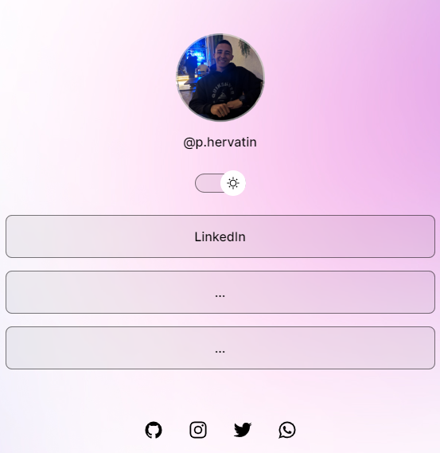

<h1 align="center"> Links-page </h1>

  

## 🚀 Tecnologias

Esse projeto foi desenvolvido com as seguintes tecnologias:

- HTML e CSS
- JavaScript
- Git e Github
- Figma

## 💻 Projeto

O Links-page é um agregador de links para usar como cartão de visitas online.

- [Acesse o projeto finalizado, online](https://paulohervatin.github.io/links-pages/)

## :memo: Licença

Esse projeto está sob a licença MIT.